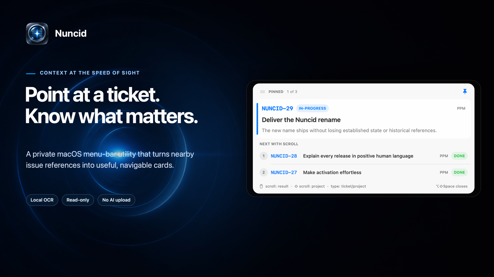
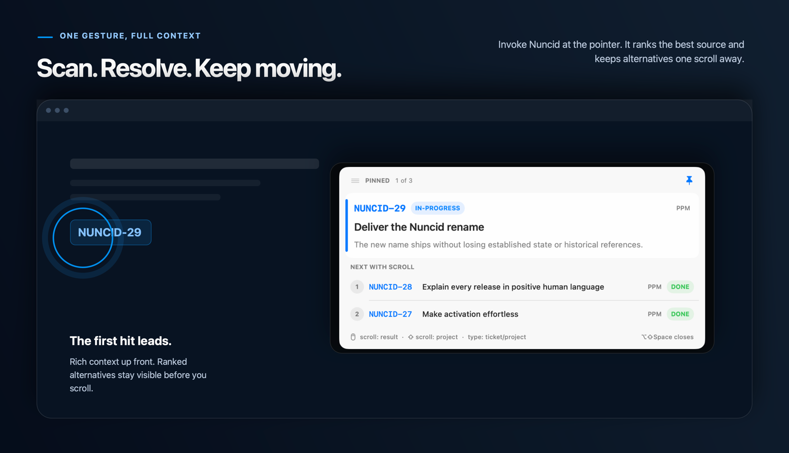
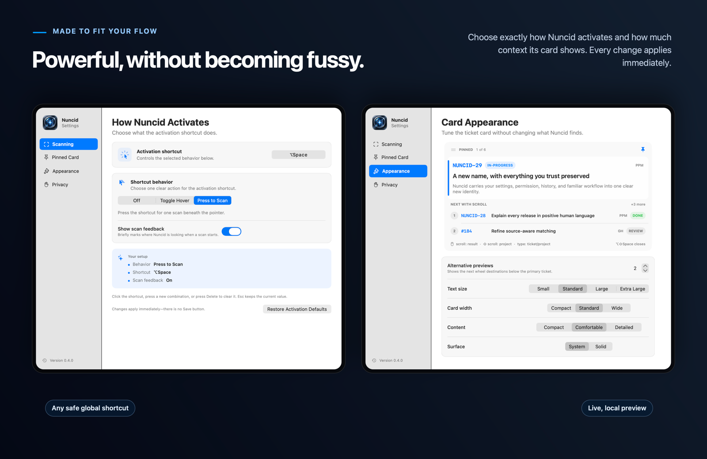
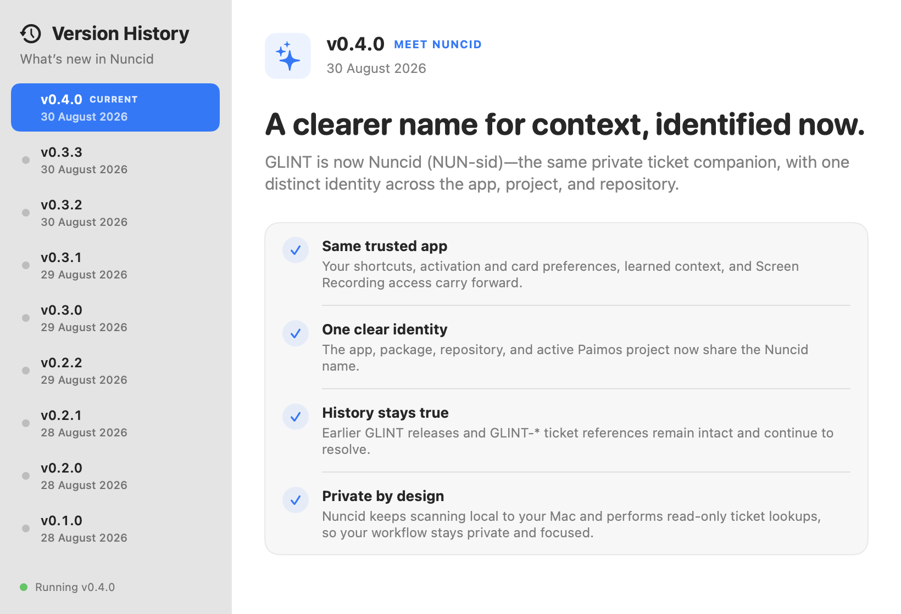

<p align="center">
  
</p>

<p align="center">
  <a href="https://github.com/markus-barta/nuncid/releases/latest"></a>
  
  
  
  
  <a href="LICENSE"></a>
</p>

<p align="center">
  <strong>Ticket context, right where you point.</strong><br>
  <strong>Nuncid</strong> (pronounced <strong>NUN-sid</strong>, formerly Glint) is a private macOS menu-bar utility that turns nearby issue references into useful, navigable cards.
</p>

<p align="center">
  <a href="https://github.com/markus-barta/nuncid/releases/latest"><strong>Download the latest release</strong></a>
  &nbsp;·&nbsp;
  <a href="#build-from-source">Build from source</a>
  &nbsp;·&nbsp;
  <a href="CHANGELOG.md">Release history</a>
</p>

## Look once. Keep moving.

Nuncid watches a small area around the pointer, recognizes ticket keys and numbers with Apple Vision, and resolves only real matches through your existing Paimos and GitHub sessions. The strongest result gets the space it deserves—key, state, title, metadata, and useful detail—while the next likely matches remain visible before you scroll.

<p align="center">
  
</p>

| Invoke anywhere | Keep context nearby | Navigate without friction |
| --- | --- | --- |
| The **activation shortcut** can stay off, toggle hover scanning, or scan once when pressed. Toggled hover scans each newly settled pointer location once—never in a timer loop. | **Pin** turns the result into a movable card with a remembered screen position. Use the handle to place it where it belongs. | Scroll through results, Shift-scroll through projects, type a number to jump tickets, or fuzzy-type a project—even with a typo. |

The small scan cue shows where Nuncid is looking, outlines recognized IDs, and confirms the selected ticket. It never steals focus and respects Reduce Motion.

## Your shortcuts. Your card.

Activation and presentation are independent on purpose. Record any safe global shortcut, choose Off, Toggle Hover, or Press to Scan, and tune how much information the card shows. The menu bar icon shows when hover is active and confirms when it finds a ticket. Settings apply immediately; the appearance preview uses local sample data and never contacts a tracker.

| Hover off | Hover on | Ticket found |
| --- | --- | --- |
|  |  |  |

<p align="center">
  
</p>

Nuncid can show zero to five alternative destinations and offers four text sizes, three widths, three content densities, and system or solid surfaces. Cards measure their content rather than forcing every ticket into the same height.

## What changed—and why it feels better

The app’s **Version History** explains each release in concise, positive human language. Open it from the menu, About window, or by clicking the version in Settings; your running version is always highlighted.

<p align="center">
  
</p>

## Smarter resolution, fewer wrong guesses

Explicit evidence wins. Nuncid combines the shape and position of nearby OCR text with GitHub URLs, the foreground app and window, the pinned card, and short-lived per-app history. It resolves strong candidates first, tries weaker fallbacks only when needed, and never fabricates a “maybe” result.

- Known PPM projects resolve through the `ppm` Paimos instance; `START` resolves through `pma`.
- Explicit GitHub pull-request URLs route directly to their repository.
- Bare numbers use nearby project text and foreground context before trying cautious fallbacks.
- GitHub lookups are limited to configured repositories or an explicit `github.com` URL. Ordinary OCR paths never become network targets.
- Only high-confidence or directly confirmed context is learned; weak guesses are not.

## Private by construction

The screen crop and Apple Vision OCR stay in the Nuncid process. No screenshot is saved or uploaded. No pixels, OCR text, or ticket content are sent to an AI model, and there is no telemetry.

Nuncid launches only local, read-only commands:

```text
paimos --instance <ppm|pma> --json issue get <key>
gh pr view … --json …
```

Those tools may contact their configured services using your existing credentials. Nuncid never writes to either service. Scan-feedback panels opt out of screen capture, and the only learned hint is a bounded, decaying project association keyed by application bundle identifier. Settings can clear it together with cached titles.

## Install

1. Download [`Nuncid-0.4.0.zip`](https://github.com/markus-barta/nuncid/releases/download/v0.4.0/Nuncid-0.4.0.zip).
2. Move `Nuncid.app` to `~/Applications` or `/Applications`.
3. Open Nuncid and grant Screen Recording when macOS asks.
4. Make sure `paimos` and/or `gh` are authenticated for the sources you use.

Default commands:

| Command | Shortcut | Behavior |
| --- | --- | --- |
| Activation | `⌥Space` | Follow the selected behavior; Press to Scan is the default. |
| Pin / direct open | `⇧⌥Space` | Open pinned, pin the temporary card, focus it, or close it. |

Both shortcuts are fully configurable. Native recorder controls reject unsafe plain-letter globals and report conflicts directly in Settings.

## Pinned navigation

| Input | Result |
| --- | --- |
| Mouse wheel | Select another resolved ticket. |
| `⇧` + mouse wheel | Keep the number and try another project. |
| Type digits | Jump to a ticket number while keeping the project. |
| Type letters | Fuzzy-match a project; the best guess previews immediately. |
| Paste `PHAROS-203`, `#203`, or `203` | Resolve a full key, pull request, or number directly. |
| Return | Apply the previewed input. |
| Escape | Clear the current input, then close. |

Typing is captured only while the pinned card is focused. Ordinary scrolling elsewhere on the Mac is never intercepted.

## Build from source

You need macOS 13 or newer, a Swift 5.10 toolchain, and authenticated `paimos` / `gh` installations for the sources you want to resolve.

```sh
swift build
./scripts/test.sh
./scripts/package-app.sh
open dist/Nuncid.app
```

The packaging script stages `dist/Nuncid.app` outside SwiftPM's cleanable build directory. It derives the build number from Git history and applies a stable local designated requirement so Screen Recording permission survives rebuilds without a paid signing identity.

## Release and visual workflow

[`VERSION`](VERSION) is the source of truth for the packaged version; [`CHANGELOG.md`](CHANGELOG.md) keeps the user-visible history.

```sh
./scripts/bump-version.sh patch "Short user-visible release summary"
./scripts/test.sh
./scripts/package-release.sh
swift scripts/render-marketing-shots.swift
```

The last command rebuilds the README hero and feature gallery from the real captured Nuncid interfaces plus the checked-in scan-field artwork. Historical GLINT captures and the [0.3.0 visual comparison](docs/compare-0.3.0.html) remain unchanged so the release record stays truthful. The [rename decision and migration record](docs/nuncid-rename-2026-08-30.md) documents the collision screen and compatibility choices.

## Project map

```text
Sources/Nuncid/              App, OCR, parsing, resolution, shortcuts, and UI
Sources/Nuncid/Resources/    Packaged visual assets
Fixtures/                    Deterministic hover/OCR test material
docs/screenshots/            Raw product captures and rendered marketing images
scripts/test.sh              Build, self-tests, and versioning regression checks
scripts/package-app.sh       Release build, app bundle, metadata, and local signing
scripts/package-release.sh   Signed app plus versioned release archive
scripts/bump-version.sh      Semantic version and changelog update
scripts/render-marketing-shots.swift
                             Reproducible GitHub image compositor
```

Nuncid is deliberately small, local-first, and read-only. Those are product constraints, not missing features.

## License

Nuncid is open-source software licensed under the [GNU Affero General Public License v3.0](LICENSE). The complete terms are included in the repository and inside every packaged app.

Copyright © 2026 Markus Barta.
