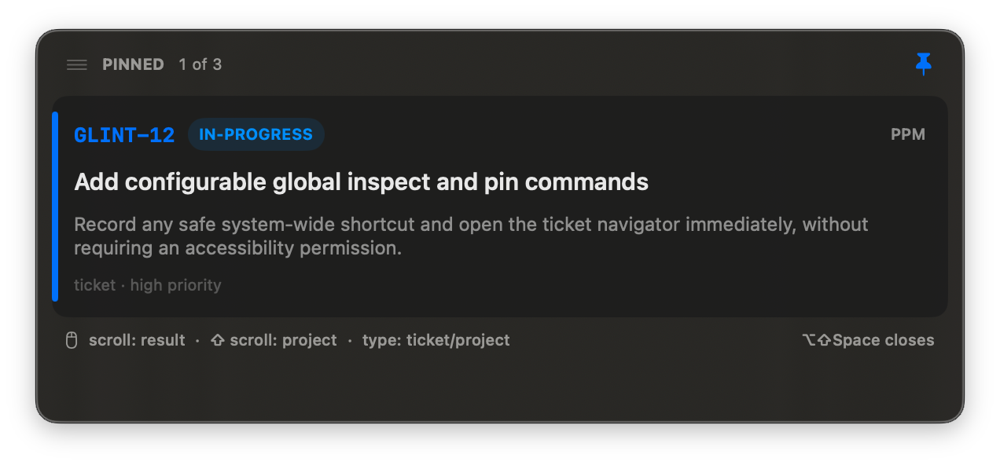
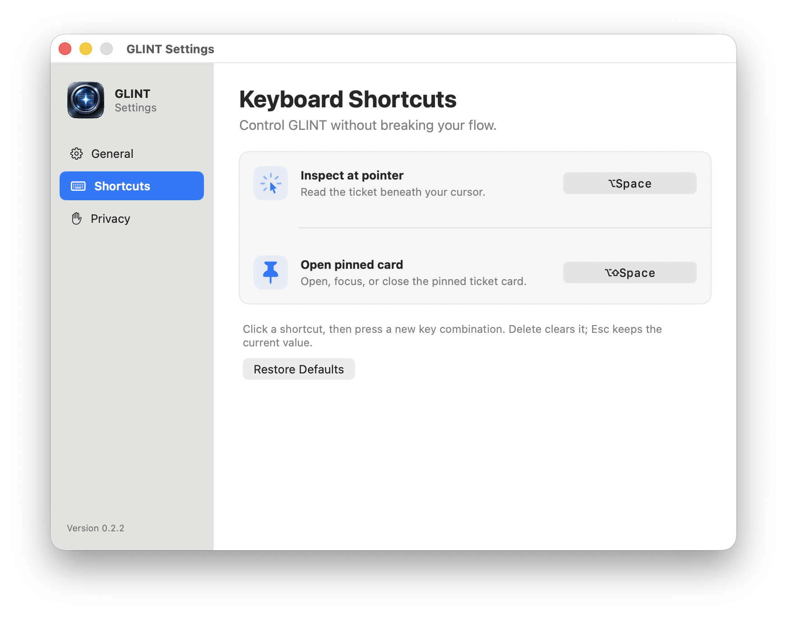

<p align="center">
  
</p>

<h1 align="center">GLINT</h1>

<p align="center">
  <strong>Ticket context, right where you are looking.</strong><br>
  A private macOS menu-bar utility that turns nearby issue references into useful, navigable cards.
</p>

<p align="center">
  macOS 13+ &nbsp;·&nbsp; Swift 5.10 &nbsp;·&nbsp; Local OCR &nbsp;·&nbsp; Read-only lookup
</p>

---

GLINT watches a small area around the pointer, recognizes ticket keys and numbers with Apple Vision, and resolves only real matches through your local Paimos and GitHub sessions. The strongest result gets a detailed card—key, state, title, metadata, and description excerpt—while the remaining hits form a small card deck you can browse without leaving the app you are using.

No screenshot is saved or uploaded. No pixels, OCR text, or ticket content are sent to a model.

## Screenshots

<p align="center">
  
</p>

<p align="center">
  
</p>

## How it feels

GLINT has two configurable global commands:

- **Inspect** (default `⌥Space`) scans at the pointer and opens a temporary card.
- **Pin / direct open** (default `⇧⌥Space`) opens GLINT pinned from anywhere, pins a temporary card, or closes an already pinned card.

Both shortcuts use native recorder controls in Settings, reject unsafe plain-letter globals, detect conflicts, and can be cleared or reset.

When pinned, GLINT becomes a compact ticket navigator:

- Drag its top handle to a fixed place on the current display; GLINT remembers and safely clamps that position when displays change.
- Scroll over the panel to move through the resolved tickets. Hold Shift while scrolling to try the same number in another project.
- Focus the panel and type digits to jump to that ticket number while keeping the project.
- Type letters to switch projects with typo-tolerant fuzzy matching; the best guess is always previewed, then applied after a brief pause or with Return.
- Paste full keys such as `PHAROS-203`, `#203`, or bare numbers directly. Backspace edits the active input; Escape first clears it, then closes.

Typing is captured only while the pinned panel is focused. Ordinary scrolling elsewhere on the Mac is never intercepted.

## Resolution model

Explicit keys take the narrowest route. Known PPM projects (`GLINT`, `HAUSV`, `INSPR`, `JANUS`, `PAI`, and `PHAROS`) resolve through the `ppm` Paimos instance; `START` resolves through `pma`. Unknown project keys can try both. Bare numbers start with the last successful tracker and project, then try the alternate context and, where mapped, a GitHub pull request.

Failures stay invisible: GLINT never invents a synthetic “maybe” row. Successful results are cached briefly for responsiveness, with misses cached for only one minute.

## Privacy and trust boundary

The screen crop and Apple Vision OCR stay in process. GLINT launches only local, read-only commands:

- `paimos --instance <ppm|pma> --json issue get <key>`
- `gh pr view … --json …` for mapped pull-request candidates

Those tools may contact their configured services under your existing credentials. GLINT does not write to either service, does not add telemetry, and does not call an LLM. macOS Screen Recording permission is required solely for the small cursor-adjacent capture.

## Build and run

You need macOS 13 or newer, a Swift 5.10 toolchain, and authenticated `paimos` / `gh` installations for the sources you want to resolve.

```sh
swift build
./scripts/test.sh
./scripts/package-app.sh
open dist/Glint.app
```

Grant Screen Recording from GLINT's menu when macOS asks. The default scan trigger is a 300 ms dwell; Settings can also switch scanning to Hold Option or Always follow.

The packaging script stages `dist/Glint.app` outside SwiftPM's cleanable build directory. It derives the build number from Git history and applies a stable local designated requirement so the Screen Recording grant survives rebuilds without a paid signing identity.

## Versions and release history

[`VERSION`](VERSION) is the single source for the packaged short version. [`CHANGELOG.md`](CHANGELOG.md) keeps the user-visible history. Bump both atomically with:

```sh
./scripts/bump-version.sh patch "Short user-visible release summary"
```

Use `major`, `minor`, or `patch`. Validate the release path with `./scripts/test.sh` before packaging.

## Project map

```text
Sources/Glint/              App, OCR, parsing, resolution, shortcuts, and UI
Sources/Glint/Resources/    Packaged visual assets
Fixtures/                   Deterministic hover/OCR test material
scripts/test.sh             Build, self-tests, and versioning regression checks
scripts/package-app.sh      Release build, app bundle, metadata, and local signing
scripts/bump-version.sh     Semantic version and changelog update
```

GLINT is currently a personal, private utility. Its narrow permissions and local-first architecture are intentional product constraints.
